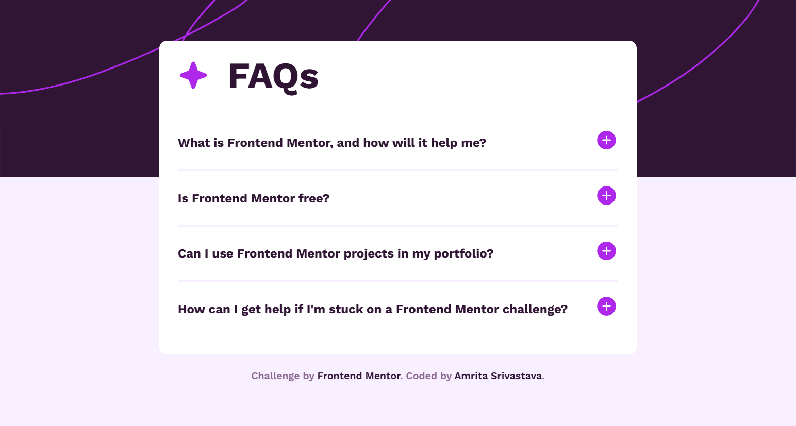

# Frontend Mentor - FAQ accordion

## Overview

This is my solution to the FAQ accordion challenge. It was built entirely with HTML, CSS and JavaScript.

## The challenge

Users should be able to:

- Hide/Show the answer to a question when the question is clicked
- Navigate the questions and hide/show answers using keyboard navigation alone
- View the optimal layout for the interface depending on their device's screen size
- See hover and focus states for all interactive elements on the page

## Screenshot

- Desktop solution
   

- Desktop solution (active state)
   

- Mobile solution (active state)
   

## Tech Stack

- Semantic HTML5 markup
- CSS custom properties
- JavaScript For styles

## Author

- [Linkedln](https://www.linkedin.com/in/amrita-srivastava10/)
